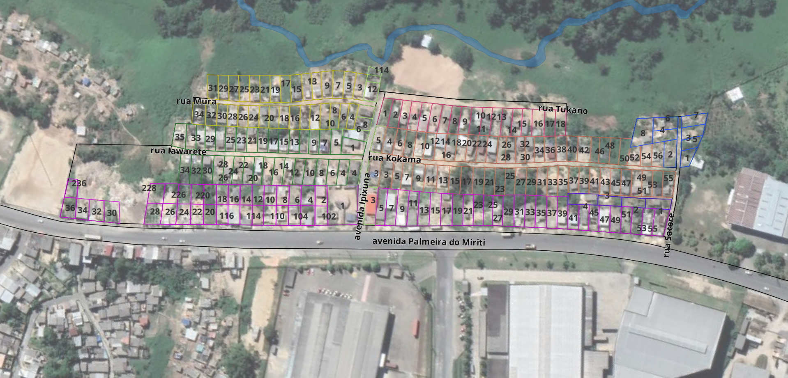

<table>
<tr>
<td align = 'left'>

A comunidade __Ipixuna - Iawareté__ congrega representantes de mais de duas dezenas de povos indígenas e não-indígenas em uma ocupação recente em ambiente urbano em Manaus. Localiza-se na Avenida Palmeira do Miriti, na Zona Leste da cidade, em área sob jurisdição da SUFRAMA. Juntamente com a COPIME, o lab Dabukuri está fazendo o levantamento, o geo-referenciamento e a confecção de documentação complementar aos pedidos de regularização fundiária das famílias da comunidade junto à Suframa. Nesta comunidade foram identificados mais de 200 terrenos e seu geo-referenciamento segue em andamento.

</td>

<td>
<!--img align = "center" width = 50px src = "DABUKURI.png" / --> 
</td>

<td align = 'right'>

Imagem de satélite com destaque para os terrenos em processo de regularização.

</td>
</tr>
</table>
