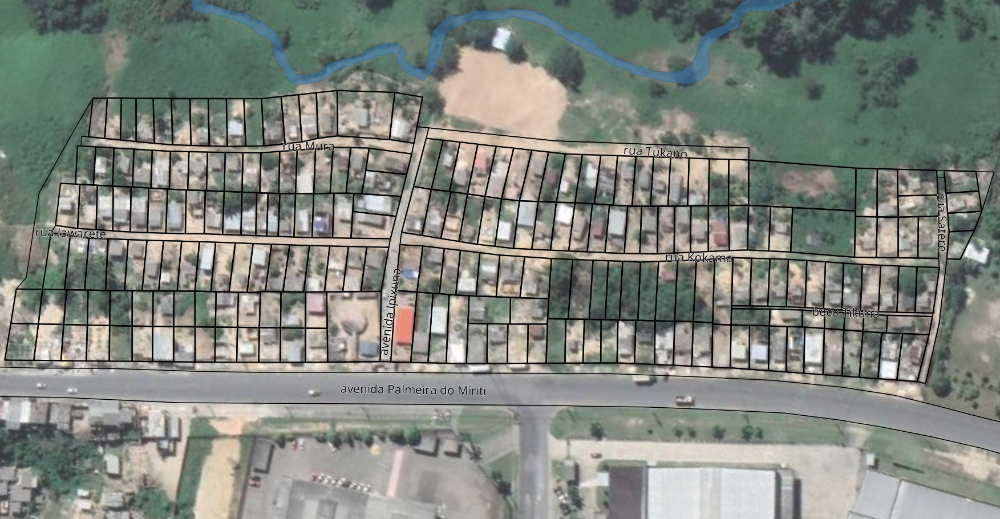

#### A comunidade __Ipixuna - Iawaretê__ fica na avenida Palmeira do Miriti, na Zona Leste de Manaus. O lab Dabukuri está fazendo o levantamento, o geo-referenciamento e a confecção de documentação complementar aos pedidos de regularização fundiária das famílias da comunidade junto à Suframa

Imagem de satélite com destaque para os terrenos em processo de regularização.