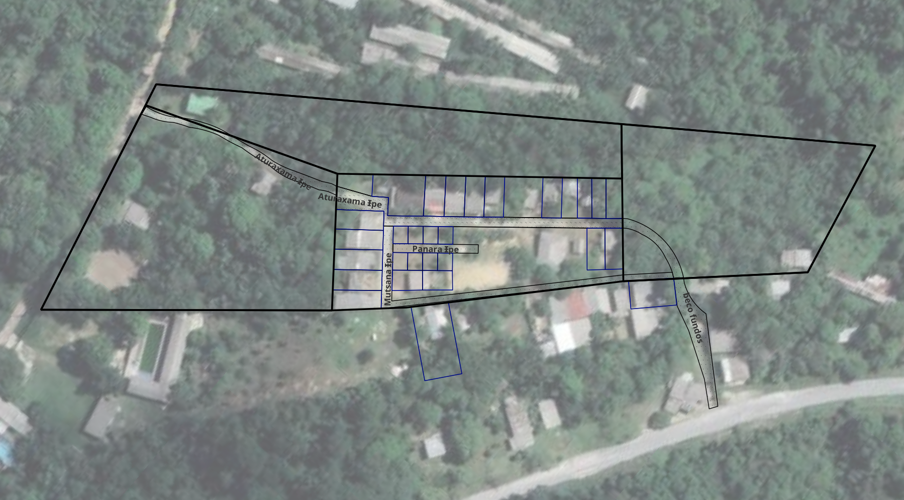

<body>

<table>
<tr>
<td>
 

<h5>A comunidade __Kokama - Nova Esperança__ fica no km 8 do ramal Brasileirinho, na Zona Leste de Manaus. O lab Dabukuri está fazendo o levantamento, o geo-referenciamento e a confecção de documentação complementar aos pedidos de regularização fundiária das famílias da comunidade junto à Suframa.</h5>

</td>

<td>

Imagem de satélite com destaque para os terrenos em processo de regularização.

</td>
</tr>
</table>
</body>