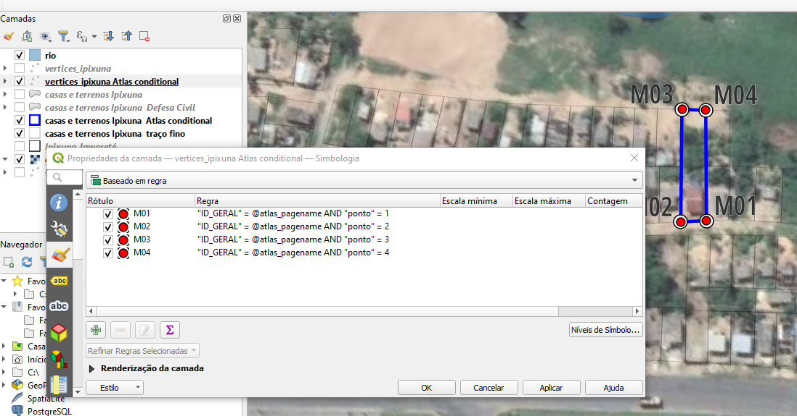
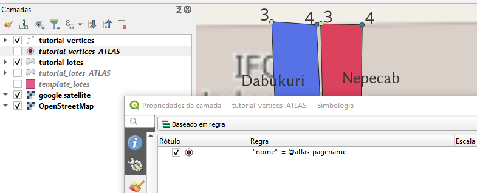
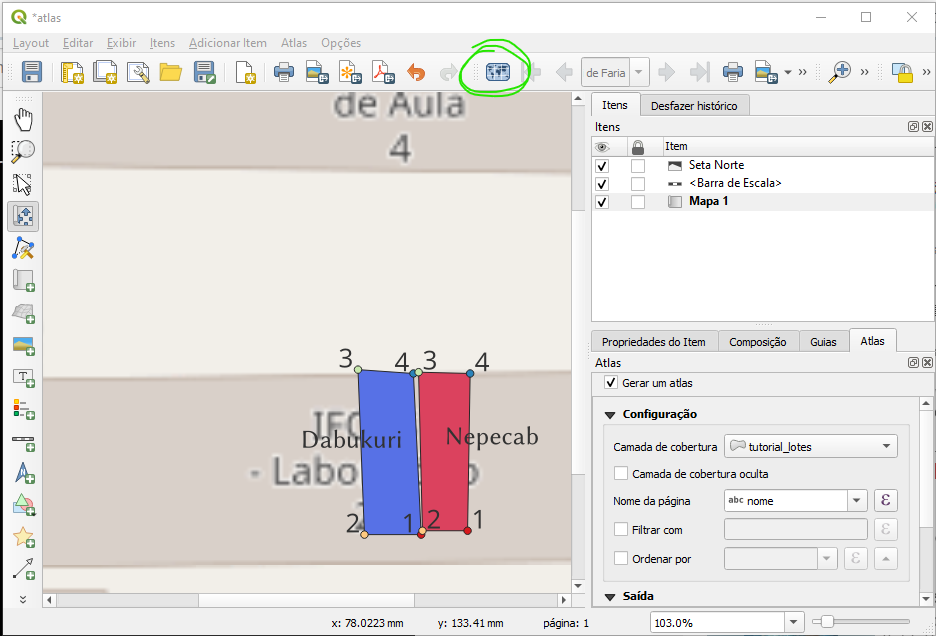
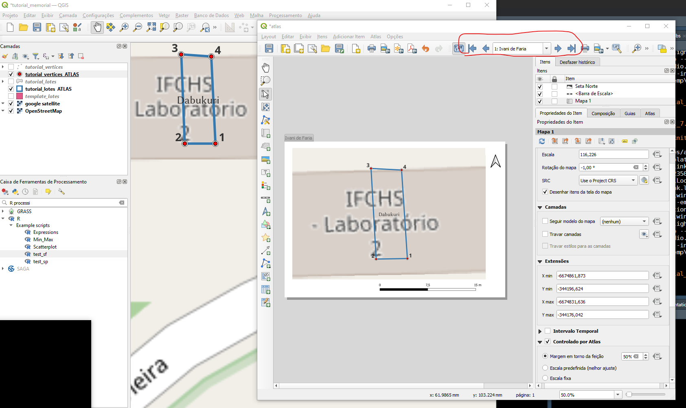
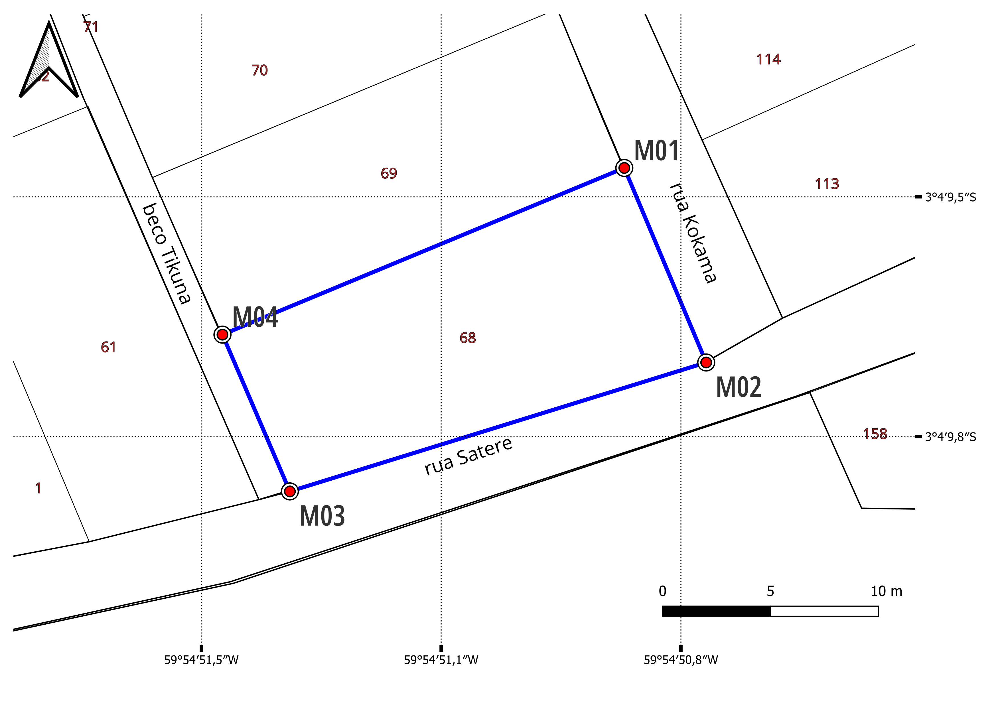
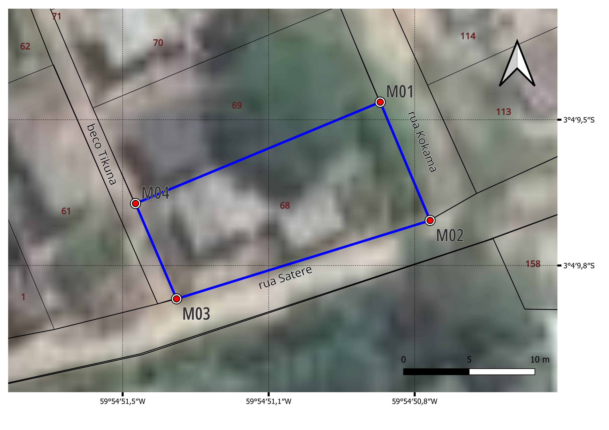
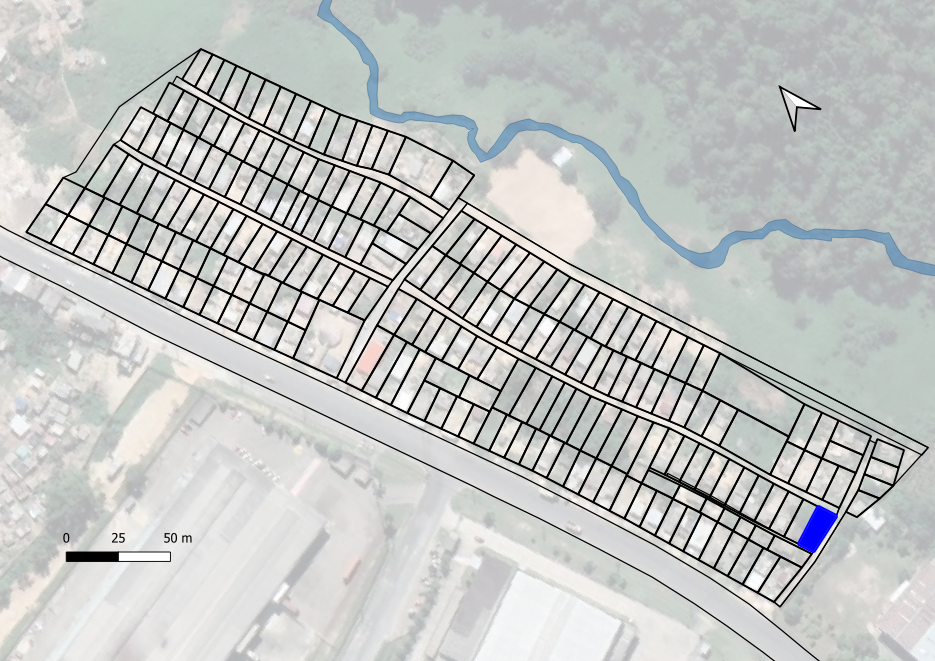
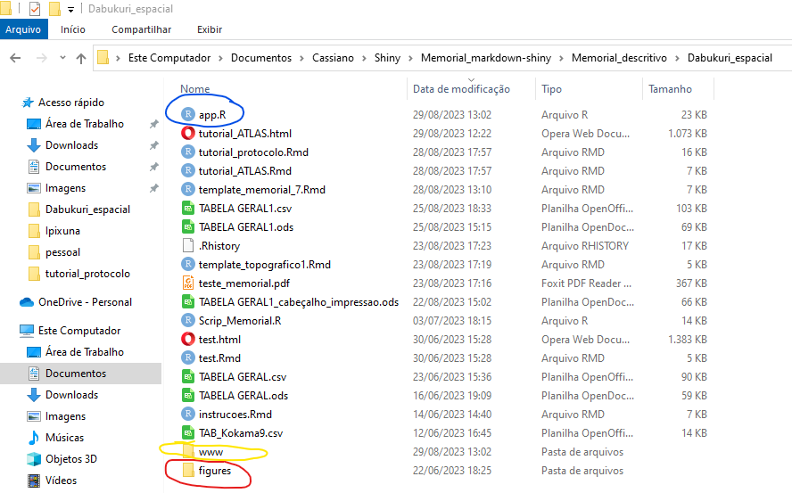
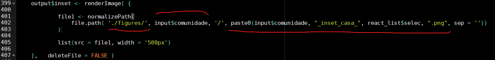

<header>

```{=html}
<style>
</style>
```
</header>

```{r setup, include=FALSE}
knitr::opts_chunk$set(include = FALSE)


```

<h2 style="text-align: center;">

QGIS Atlas - figuras individuais dos lotes

</h2>

<h5 style="text-align: right;">

Cassiano Gatto

</h5>

```{=html}
<div style = "float: right";> </div>
```
### Atlas no QGIS

Aqui um rápido tutorial sobre o uso do Atlas no QGIS pra gerar figuras individuais dos lotes. O Atlas funciona no modo layout do QGIS - então é bom já saber um pouco sobre o layout... Aqui apresentaremos o básico.

No projeto que já conhecemos vamos:

1) criar cópias das camadas que temos dos polígonos e dos pontos extremos (dê nomes sugestivos e.g. Atlas ao invés de cópia... figura 1) que serão classificadas para mostrar apenas as feições desejadas (para tirar a foto!)

2) classificá-las para controlar sua exibição por um índice gerado pelo Atlas a partir de uma variável qualquer em uma camada (e.g. ID_geral - vamos configurar o Atlas mais adiante).

::: {.container style="align-itens: center;"}

<p>figura 1. Exemplo de cópias das camadas e classificação pelo índice Atlas no projeto Ipixuna</p>
:::
<br>

Pode-se ainda identificar feições individualmente, como no exemplo apresentado para os pontos no projeto Ipixuna (figura 1), ou apenas uma regra simples (figura 2): nas propriedades da camada -> simbologia, escolher a opção 'baseado em regra', adicionar ('+') e editar ('Epsilon') a regra, escolhendo a variável (campo) = @Atlas_pagename. Fazer o mesmo para as outras camadas ;-)

Lembre-se que é nesta classificação que o layout destas feições na figura deve ser programado. Eu gosto de deixar o polígono sem preenchimento, apenas com o contorno em azul bem forte. Os pontos eu deixo bem grandes, com uma simbologia composta de um círculo transparente envolvendo um ponto vermelho no centro, como mostrado na figura 1.

::: {.container style="align-itens: center;"}

<p>figura 2. Regra de classificação baseada no Atlas </p>
:::
<br>

##### Layout time!

Vá para Projeto -> Novo layout de impressão (ctrl-P); escolha um nome.

Adicione uma camada de mapa: Adicionar item -> Adicionar mapa -> defina a extensão do mapa no layout clicando e arrastando.

Se desejar inclua outros items no seu mapa final, como escala, norte, ou mesmo um grid com coordenadas geográficas. O grid pode ser configurado nas propriedades do Mapa1 que vc acabou de adicionar.

No menu Atlas clique em 'gerar um Atlas' e escolha uma camada com a variável que guiará todo o processo. Em nosso caso o que nos interessa são as variáveis 'nome' ou 'casa' que podem ser encontrada na camada tutorial lotes, por exemplo; estas variáveis diferenciam os poligonos individuais Dabukuri e Nepecab. O importante é que a variável escolhida para classificar as feições deve ser a mesma que gera os valores únicos no Atlas.

Veja que no campo de expressão do nome de saída pode-se escolher um padrão de nome para o output. Eu escolhi  "'Atlas_tutorial_'||@atlas_pagename", onde o nome de cada feição será o identificador único do arquivo (poderia ser o número usando @featurenumber).

::: {.container style="align-itens: center;"}

<p>figura 3. Layout com aba do Atlas e botão preview </p>
:::
<br>

Agora configure o mapa no layout para obedecer aos comandos do Atlas. Clique botão direito no Mapa1 e escolha propriedades do Item. Ative o item 'controlado por Atlas' e decida se a escala será definda pelo Atlas ou definida como a mesma em todas os polígonos (a escolha da escala é lá em cima mas precisa estar definida no Atlas como fixa).

Ative o Atlas preview! (figura 3 em verde!).

Não esqueça de selecionar apenas as camadas desejadas (controladas por Atlas) no projeto original e configurar com mais detalhe os formatos dos símbolos - eu gosto de exagerar na largura do traço e no tamanho dos pontos nessas imagens individuais de cada polígono.

::: {.container style="align-itens: center;"}

<p>figura 4. Atlas em funcionamento! </p>
:::
<br>

Agora podemos tirar as fotos. Você pode fazer uma à uma, selecionando uma opção no navegador do Atlas (em vermelho na figura 4), ou pedir pro Atlas rodar sozinho (ícone ao lado do navegador Atlas) para todos os polígonos descritos pela variável escolhida (nome). Ele salva na pasta que você determinar, com o nome automaticamente adaptado para cada feição individual.

Assim você pode configurar várias formas de apresentação de layout para cada feição de acordo com o tipo de documento e salvar cada uma delas com um padrão diferente. Eu vou mostrar os exemplos que eu criei para a comunidade Ipixuna para o Memorial Descritivo e para o Levantamento Topográfico, que possuem formatos específicos de nome para que sejam lidos apropriadamente pelos templates em R-Markdown. Ah, para o levantamento eu criei uma terceira cópia dos lotes e preenchi com cor para apresentar qual o lote em relação à comunidade toda. Para isso eu fixei o layout e não deixei o Atlas controlar a posição, apenas qual feição seria exibida.

::: {.container style="align-itens: center;"}

<p>figura 6. Casa 68 da comunidade Ipixuna - layout do Memorial descritivo, em preto e branco com a camada de satélite desativada. Formato "Ipixuna_P&B_casa_XX.png" </p>
:::
<br>

::: {.container style="align-itens: center;"}

<p>figura 7. Casa 68 da comunidade Ipixuna - layout do Levantamento Topográfico. Formato "Ipixuna_casa_XX.png" </p>
:::
<br>

::: {.container style="align-itens: center;"}

<p>figura 8. Casa 68 da comunidade Ipixuna - layout do Levantamento Topográfico. Formato "Ipixuna_inset_casa_XX.png" </p>
:::
<br>

##### Onde salvar as figuras?

Estas figuras devem estar em um sub-diretório abaixo daquele que guarda o __app.R__ responsável pela renderização dos documentos - neste caso o __app.R__ na pasta Dabukuri_espacial (figura 9).

::: {.container style="align-itens: center;"}

<p>figura 9. Folder onde se localizam o app.R e os folders www e figures </p>
:::
<br>

::: {.container style="align-itens: center;"}

<p>figura 10. Construção do endereço de chamada das figuras que usa o nome da comunidade como folder e a estrutura do arquivo como indicativos para localizar a foto correta.</p>
:::
<br>

 As figuras estão no diretório *figures* em diretórios com nomes das comunidades. Assim, quando ativo, o aplicativo deve chamar as figuras nos respectivos *paths* (figura 10).


