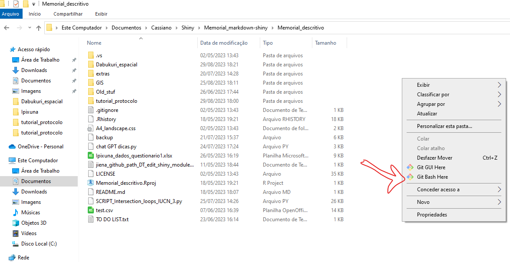
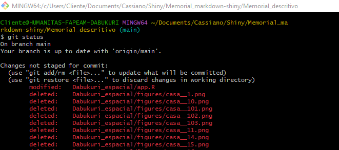
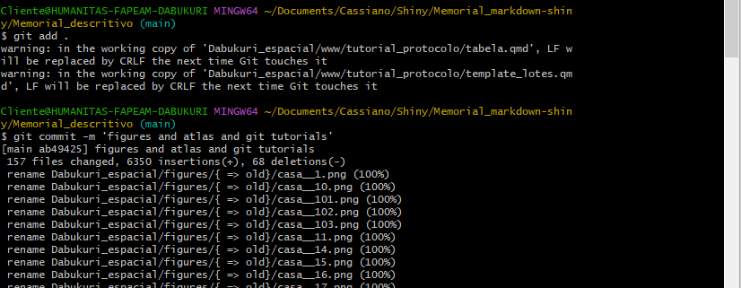

<header>

```{=html}
<style>
</style>
```
</header>

### GIT GIT GIT

Git é um sistema de backup baseado em comparação de versões. Seu pleno potencial é alcançado quando utilizado em combinação com o <http://github.com>.

Este projeto inteiro tem uma imagem espelhada no endereço <http://github.com/cassianogatto/memorial_descritivo> e esta versão *online* oferece a possibilidade de rodar o **app Dabukuri** de qualquer computador com o programa R instalado. Melhor ainda se [RStudio](https://posit.co/download/rstudio-desktop) estiver instalado porque ele cuida automaticamente das dependências, libraries, etc.

No console do RStudio, basta digitar:

    library(shiny)
    runGitHub( "cassianogatto/memorial_descritivo/Dabukuri_espacial", "cassianogatto")

#### Espelho de diretório local

Esta página é um backup que deve ser sempre atualizado. Todas as versões anteriores podem ser recuperadas, mas estas propriedades avançadas não serão discutidas aqui.

Pra começar é preciso identificar o diretório no computador que corresponde exatamente ao diretório github. Neste projeto o diretório é:

    C:/Users/Cliente/Documents/Cassiano/Shiny/Memorial_markdown-shiny/Memorial_descritivo

Após abrir no explorer, clicar com botão direito e escolher 'git bash' (figura 1)

::: {.container style="align-itens: center;"}
 <br>
<p>figura 1. Abrindo GIT BASH</p>
:::

Agora digitaremos comandos que sempre iniciam com **'git'**!

Via de regra, é sempre bom checar como estão as coisas com 'git status' (figura 2). Git responde com todos os arquivos acompanhados (embaixo os não acompanhados) que não estão com suas versões (local e remota) sincronizadas em vermelho.

::: {.container style="align-itens: center;"}
 <br>
<p>figura 2. GIT status</p>
:::

Para começar a sincronização deve-se adicionar estes arquivos ao 'stage' (palco). Para adicionar todos basta digitar 'git add .' (figura 3; para adicionar um à um 'git add <arquivo>').

O próximo passo é realizar o update local dos dados e substituir os arquivos modificados pelos novos (COMMIT): 'git commit -m "<mensagem descrevendo o commit>"' (figura 2). Cada commit
tem um identificador único que pode ser acessado com 'git log' e também uma descrição dos detalhes mais pertinentes das mudanças feitas. Futuramente, essas descrições ajudam a identificar as versões que foram atualizadas de cada arquivo.

::: {.container style="align-itens: center;"}
 <br>
<p>figura 3. GIT add e GIT commit</p>
:::

Pronto, a versão local dos arquivos está atualizada. Agora basta empurrar estas mudanças para o diretório remoto, usando 'git push' e conferindo o resultado (figura 4). 

::: {.container style="align-itens: center;"}
 <br>
<p>figura 4. GIT push</p>
:::

Quando existem terceiros atualizando a mesma página (um computador em casa, por exemplo), é sempre recomendado fazer um **upload** dos arquivos locais a partir do acesso remoto, o que diminui a chance de conflito com mudanças locais não atualizadas remotamente.

Para isso basta fazer um **'git pull'** antes de fazer quaisquer modificações nos arquivos locais (antes de começar a trabalhar!)


This is an R Markdown document. Markdown is a simple formatting syntax for authoring HTML, PDF, and MS Word documents. For more details on using R Markdown see <http://rmarkdown.rstudio.com>.

When you click the **Knit** button a document will be generated that includes both content as well as the output of any embedded R code chunks within the document. You can embed an R code chunk like this:

```{r cars}
summary(cars)
```

## Including Plots

You can also embed plots, for example:

```{r pressure, echo=FALSE}
plot(pressure)
```

Note that the `echo = FALSE` parameter was added to the code chunk to prevent printing of the R code that generated the plot.
