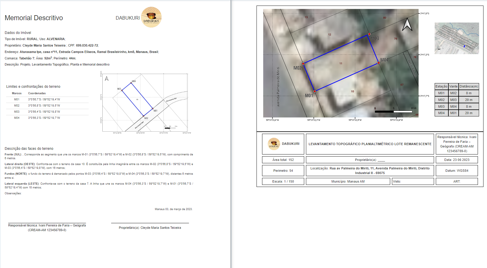
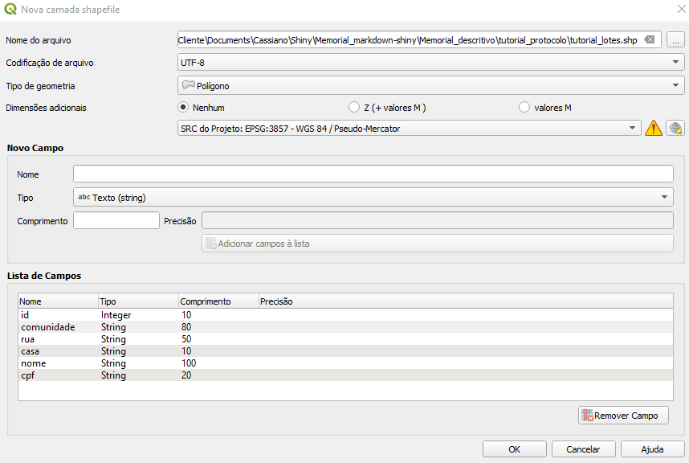
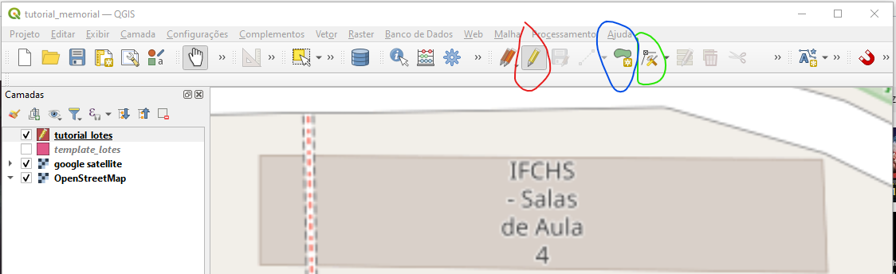
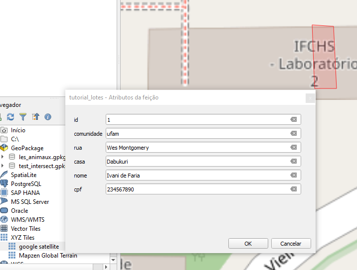
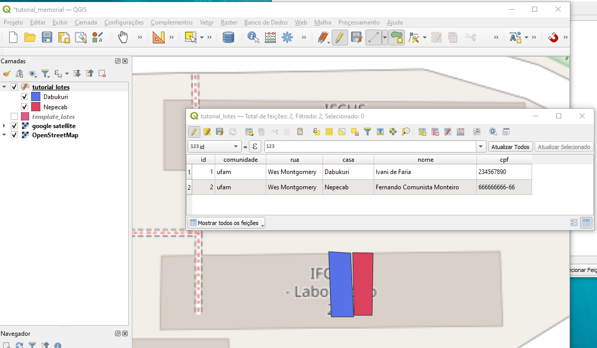
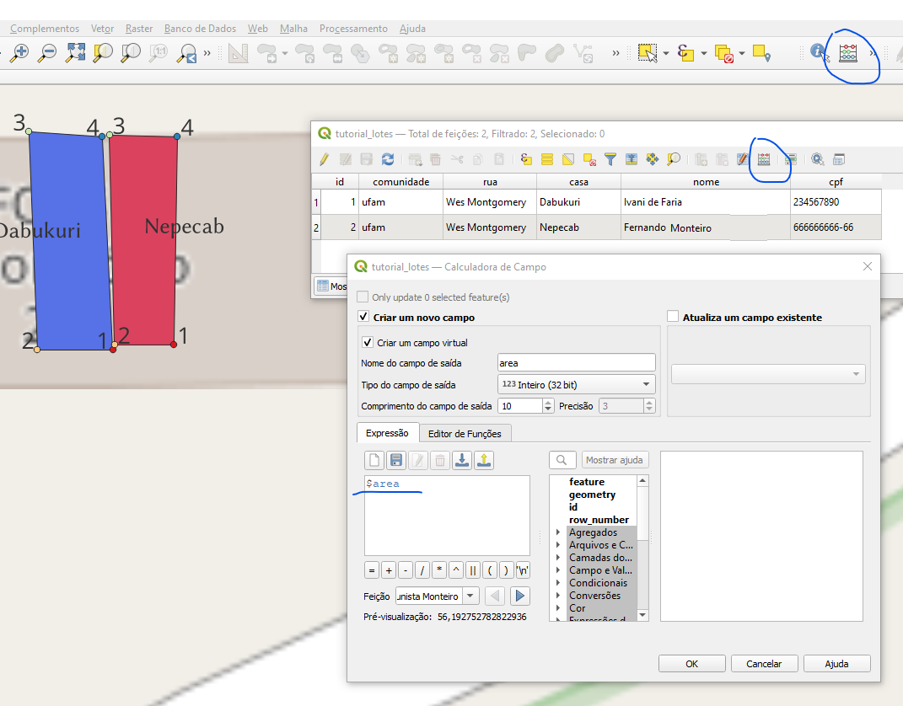
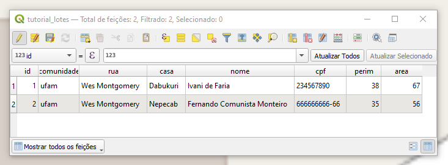
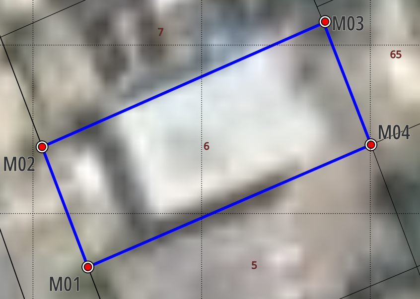
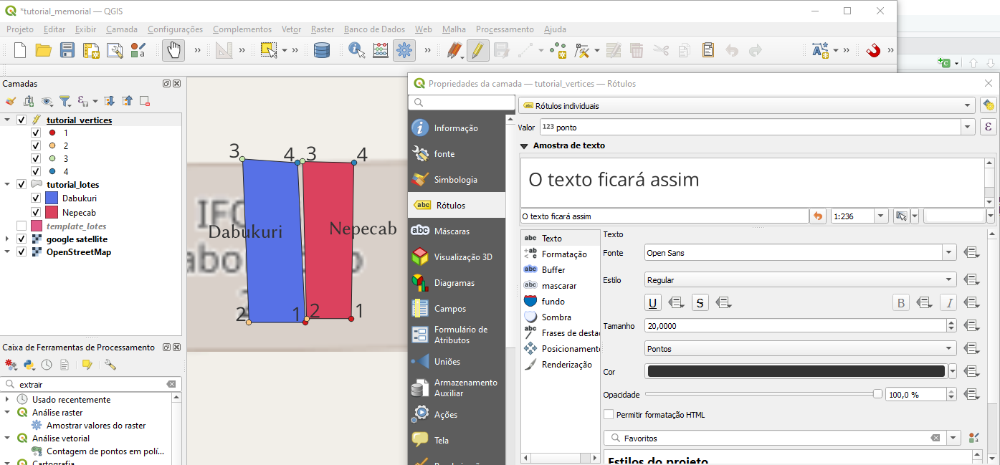

<header>
<style>
</style>
</header>

```{r setup, include=FALSE}
if (requireNamespace("thematic")) 
  thematic::thematic_rmd(font = "auto")

# former yaml theme config
# bg: "#202123"
#       fg: "#B8BCC2"
#       primary: "#EA80FC"
#       secondary: "#00DAC6"

```

<h2 style="text-align: center;"> Memorial Descritivo e Levantamento Topográfico no Dabukuri App </h2>

<h5 style = "text-align: right;"> Cassiano Gatto </h5>

<div style = "float: right";> </div>

### Introdução

Neste tutorial proponho um protocolo e algumas ideias gerais para gerar dois documentos de geo-referenciamento necessários para atividades de regularização territorial no âmbito do projeto __Direito ao Território__ (Humanitas FAPEAM). O protocolo prevê o uso de dois programas de código aberto:

1) [QGIS](https://qgis.org/en/site/) para fazer a representação espacial geo-referenciada dos lotes, que inclui o desenho de polígonos e extração de pontos extremos, distâncias, áreas e figuras; 

2) o app baseado em [R](www.cran.org) e [Shiny](https://shiny.posit.co) que desenvolvi para usar _templates_ [RMarkdow](https://rmarkdown.rstudio.com) para gerar os documentos em formato _HTML_ (que podem ser impressos em _PDF_ através do seu browser).

Mesmo que haja variação no tipo de terreno e processo de legalização, em todos os casos lotes individuais devem ser mapeados e ter suas características espaciais documentadas. Aqui faremos a representação espacial destes terrenos em formato vetorial, extrairemos os dados destas representações e com esses dados produziremos tanto o __Memorial Descritivo__ quanto o __Levantamento Topográfico__ (Figura 1).

<div class = "container" style = "align-itens: center;">
<br>
<p>Figura 1. Documentos: Memorial descritivo e Levantamento topográfico</p>
</div>
 
### QGIS

##### Criando polígonos dos lotes

Começaremos com o programa de geo-referenciamento, cruzando os pontos obtidos em campo com imagens de satélite ou drone para desenhar, um a um, os lotes, os caminhos, as áreas verdes, áreas de perigo, e as áreas comuns da comunidade.

1. Exporte seus pontos de referência de campo coletados na comunidade e salve como um objeto *.shp*; dê um zoom para a camada carregada no QGIS.

2. Se você não tiver todos os exatos pontos de interesse coletados, abra uma imagem georeferenciada de sobrevôo de avião ou drone, ou uma base de imagens georreferenciadas atual que mostre os lotes em estudo (e.g. Navegador/ XYZ Tiles/ Google, OpenStreetMap, etc). Assim é possível 'desenhar' todos os lotes e áreas de interesse (mesmo sem ter todos os pontos) com base na imagem de *background*. Esta imagem também é importante para verificar a validade dos pontos coletados.

3. Para fazer o esquema espacial dos lotes crie uma nova camada vetorial de polígono (Camada/ Criar nova camada/ Nova camada shapefile -> escolha o nome, e.g. tutorial_lotes.shp). Use as configurações UTF-8, polígono, CRS epsg 4326 WGS84 (graus) ou epsg 3857 WGS84 PseudoMercator (metros, ou qualquer CRS de sua preferência) e inclua os campos (colunas na tabela) nesta ordem (veja a Figura 2): id (*Integer*), comunidade, rua, casa, nome, cpf (todas *String*).

<div class = "container" style = "align-itens: center;"> 
 <br>
<p>Figura 2. Criando polígono vetorial no QGIS </p> 
</div>

4. Habilite a edição (botão direito sobre a camada -> _Alternar edição_ - veja que o lápis aparece junto ao ícone na barra de camadas - Figura 3) e utilize o botão de _Adicionar polígono_ (Figura 3, em azul). Outros botões da barra de vetorização são também usados para habilitar e desabilitar edição (vermelho) e salvar (verde).

<div class = "container" style = "align-itens: center;"> 
<br>
<p>Figura 3. Habilite a edição vetorial no QGIS</p>
</div>

5. Crie os polígonos, um a um: com o mouse no exato local clique no primeiro ponto extremo do lote (ponto 1), desloque até o segundo e clique (ponto 2), e assim sucessivamente - quando tiver concluído todos os pontos clique botão direito. Preencha o formulário que vai aparecer com os dados disponíveis a respeito deste lote com o cuidado de gerar um único número de identificação ( _id_ Figura 4). Este formulário mostra as colunas criadas anteriormente - esta tabela será utilizada como base em todas as etapas futuras. Crie outros polígonos de outros lotes da mesma forma.

<div class = "container" style = "align-itens: center;"> 
<br>
<p>Figura 4. Desenho do primeiro polígono e formulário de atributos</p>
</div>

Se você for completar e expandir um shapefile já existente (e sua respectiva tabela, por exemplo [aqui](https://github.com/cassianogatto/Memorial_descritivo/blob/main/Dabukuri_espacial/TABELA%20GERAL.csv)), basta habilitar a edição da mesma forma e continuar desenhando os polígonos e preenchendo a tabela nesta nova comunidade.

É sempre bom lembrar que todas as informações necessárias para que os _templates_ dos documentos possam ser preenchidos são obtidos da tabela, que é a fonte de dados dos proprietários, de endereço, dos pontos demarcadores dos terrenos, do comprimento dos lados, área (Figura 5), e também o identificador referencial para nomear e chamar as figuras que criaremos a seguir. No modo edição a tabela pode ser editada - lembre-se sempre de salvar as alterações e sair do modo de edição para evitar acidentes.

<div class = "container" style = "align-itens: center;">
 <br>
<p>Figura 5. Tabela de atributos</p>
</div>

Ainda com o modo de edição ativado, pode-se calcular o perímetro e área total dos lotes. Para isso utilizaremos a calculadora (ícone do ábaco Ctrl-I) no painel e na tabela (Figura 6). Nela criamos uma nova coluna (_Integer_ ou _Float_), damos o nome de _area_ e aplicamos a fórmula *\$area*; repetir o procedimento para perímetro com o nome _perim_ e a fórmula *\$perimeter*.

<div class = "container" style = "align-itens: center;">
 <br>
<p>Figura 6. Calculadora (ícone em azul) para criar novo campo com valor calculado de *area*; a função está sublinhada.</p>
<br>
<br>
<p>Figura 7. Tabela atualizada com campos _area_ e _perim_.
</div>


##### Extração dos pontos-limite dos terrenos

Cada polígono é baseado em pontos ligados por segmentos. Neste ponto utilizaremos a ferramenta de extração de vértices de polígonos e que cria uma nova tabela na qual cada ponto é representado por uma linha (Figura )

<div class = "container" style = "align-itens: center;">  
 <br>
<p>Figura . Extrair vértices dos polígonos</p>
</div>

É importante ressaltar que a ordem de construção dos pontos (marcos) do polígono é recuperada pela ferramenta de extração: o primeiro ponto é identificado pela coluna *vertex_ind* como 0, o segundo como 1, o terceiro como 2, etc. Assim, para seguir o padrão de numeração dos extremos, que é o ponto 1 na frente à esquerda, o ponto 2 na frente à direita, o ponto 3 nos fundos à direita e o ponto 4 nos fundos à esquerda (Figura ), com a tabela vertices com seu modo de edição habilitado, criamos uma coluna chamada ponto e nomeamos os 4 extremos de 1 a 4. Para isso deve-se usar o calculador e aplicar a fórmula  "vertex_ind" + 1 para uma nova coluna chamada "ponto" (Figura ).

<div class = "container" style = "align-itens: center;">
<br>
<p>Figura . Esquema de orientação dos pontos (marcos) no terreno</p>
<br>

<p>Figura . Renomear os pontos por calculador</p>
</div>

<br>

Para melhor visualizar os pontos pode-se habilitar rótulos e cores por classes (em propriedades da tabela -> Rótulos e Simbologia - Figura 9).

<table><tr><td width = '80%'> 

</td><td width = '20%'>
<code>Figura 9. Configurar rótulos dos pontos</code>
</td><tr></table>


<br>

Para gerar o 'Memorial Descritivo' e o 'Levantamento Topográfico', abaixo, é utilizada 


<br>
<br>
<br>

<br>
<br>
<br>


This is an R Markdown document themed with [`{bslib}` package](https://rstudio.github.io/bslib/). `{bslib}` makes it easy to customize the main colors and fonts of a `html_document`, [`flexdashboard::flex_dashboard`](https://flexdashboard-pkg.netlify.app/articles/articles/theme.html), [shiny::fluidPage()](https://shiny.rstudio.com/reference/shiny/latest/fluidPage.html), or more generally any website that uses [Bootstrap](https://getbootstrap.com/) for styling. The `theme` parameter in the yaml front-matter of this Rmd document describes a [`bslib::bs_theme()`](https://rstudio.github.io/bslib/reference/bs_theme.html) object, which provides access to 100s of [theming options](https://rstudio.github.io/bslib/articles/bs5-variables.html) (via its `...` argument) in addition to the main options demonstrated here (e.g., `bg`, `fg`, `primary`, etc).

This particular example uses `{bslib}`'s default [Bootstrap version (which, at the time of writing, is Bootstrap 5)](https://rstudio.github.io/bslib/articles/bslib.html#versions). However, if reproducibility is important, it's recommended that you "lock-in" the version by adding `version: 5` to the `theme` definition.

## Themed Plots {.tabset .tabset-pills}

When running this document with [`{thematic}`](https://rstudio.github.io/thematic/) installed, the `thematic::thematic_rmd(font = "auto")` effectively translates `theme` (CSS) settings to new global theming defaults for `{ggplot2}`, `{lattice}`, and `{base}` R graphics:

### ggplot2

```{r}
library(ggplot2)

ggplot(mpg, aes(displ, hwy)) +
  geom_point() + geom_smooth()
```

### lattice

```{r}
lattice::show.settings()
```

### base

```{r}
plot(pressure, col = thematic::thematic_get_option("accent"))
```
